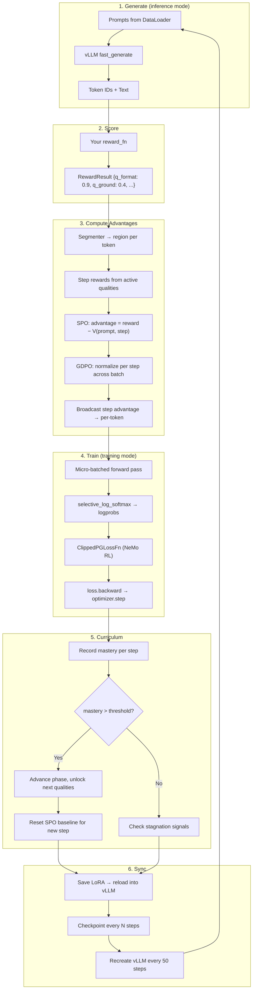

# QGRE Engine

**Quality-Gated Reward Escalation.** A training engine that grounds LLM reasoning in domains where the model has never seen the output format, the reasoning protocol, or the definition of "correct."

One GPU. One process. No Ray, no verl, no TRL, no critic network.

A 1.7B model trained with QGRE on Hamiltonian mechanics — a domain absent from its pretraining data — writes correct physics derivations in 50 steps. It identifies kinetic and potential energy terms, applies the Legendre transform, and produces Hamilton's equations of motion with `<think>` reasoning traces. Not because it memorized solutions. Because the training signal taught it the *protocol* for deriving them.

The thesis: SFT teaches models to match outputs. Standard RL teaches models to compare completions. QGRE teaches models to ground their reasoning in the structure of the input. The difference is not optimization — it is what the gradient *points at*.

---

## What happens when you train on a domain the model has never seen?

Every existing RL framework assumes the model already knows the output format. verl's math recipes work because the base model has seen `\boxed{answer}` during pretraining. TRL's GRPO works because instruction-tuned models already follow formatting prompts.

Train on a novel domain — hypergraph incidence structures, symbolic physics, financial compliance schemas — and the assumption fails. The model's first completions are structurally wrong. Every completion in the batch is structurally wrong. The group mean of 8 wrong completions is still wrong. A single scalar reward on structural garbage produces noise. The gradient from that noise points nowhere.

This is the cold start problem. It is not a hyperparameter issue. It is a *credit assignment* failure: the model receives one number for an output that has multiple independently-assessable components, and it cannot determine which component the number refers to.

QGRE solves this with six mechanisms applied simultaneously:

1. **Decompose the reward.** Your reward function returns per-quality scores, not a single scalar. `q_format: 0.9`, `q_grounding: 0.4`, `q_accuracy: 0.0` — each quality scored independently, each giving partial credit. The partial credit is not a compromise. It is the gradient. The distance from 0.4 to 1.0 tells the model which direction to move.

2. **Target the right tokens.** The reward function returns `scored_spans` — the character positions of every expression it scored. The engine maps these to token indices via the tokenizer's own `offset_mapping` and applies advantages to exactly those tokens. When the model writes `V = kx²/2` in the derivation *and* in the labeled answer, both spans receive the V_correct signal. The model learns where it decided wrong, not where it copied the decision.

3. **Gate the curriculum.** Phase 1 activates only format qualities. The model learns "what shape should my output be?" without distraction from grounding or accuracy signals. When format mastery exceeds the threshold, phase 2 activates grounding. Each skill becomes the foundation for the next.

4. **Preserve the gradient through the baseline.** SPO's persistent EMA baseline can converge to match constant partial credit — advantage goes to zero, gradient dies. The aspiration gap prevents this: `A = (r − baseline) + β × (r − target)`. The second term measures distance from the mastery threshold, not from expected performance. A score of 0.4 against a target of 0.8 produces −0.2 advantage *even when the baseline matches.* The shaped reward gradient survives.

5. **Surface suppressed knowledge.** LoRA fine-tuning can suppress base model knowledge — the adapter learns a shortcut that ignores what the pretrained weights already know. LoRA dropout applies Bernoulli masks to adapter input projections during generation, partially reverting to base model behavior. Different masks produce different internal reasoning paths. The diversity comes from representations, not token sampling. Anneals to zero as the model internalizes what the dropout surfaced.

6. **Freeze the baseline when it's wrong.** When reward variance for a prompt drops near zero, the EMA baseline has converged to a constant wrong answer. The variance-aware mechanism slows the baseline update rate proportionally. The baseline freezes. When exploration finally produces a correct answer, the advantage is massive — and persistent, because the frozen baseline doesn't chase it.

The result: a model that bootstraps from zero knowledge of the domain. No SFT warm-up needed. No hand-crafted easy examples. The curriculum IS the warm-up.

---

## Results

**Hamiltonian mechanics** — Qwen3-1.7B, 4-bit quantized, single RTX 5080 (16GB):

| Step | Avg Reward | Min | Max | What the model produces |
|------|-----------|-----|-----|------------------------|
| 0 | 0.61 | 0.40 | 0.96 | Guessing. Some correct structure by chance. |
| 3 | 0.93 | 0.85 | 0.98 | Identifies T and V. Derives Hamilton's equations. |
| 18 | 0.98 | 0.96 | 1.00 | Near-perfect derivations with reasoning traces. |
| 33 | 0.97 | 0.94 | 1.00 | Sustained accuracy across varied physical systems. |
| 47 | 0.94 | 0.94 | 0.95 | Converged. Consistent quality across all prompts. |

50 steps. ~35 seconds per step at 4096 tokens. 6.2 GB peak VRAM. Zero VRAM growth over the full run.

```
SCORE: 0.98
<think>
Okay, so I need to derive the Hamiltonian H(x, p) from first principles
for a block attached to a spring on a frictionless surface. The block has
mass 3 kg, the spring constant is 6 N/m...
```

The reward function checks symbolic correctness against sympy-computed ground truth. The model was not fine-tuned on physics. It learned the derivation protocol through QGRE's decomposed training signal.

---

## How this differs from existing engines

The question is not "which framework is better." The question is: what does the gradient point at?

| | **QGRE Engine** | **verl** | **TRL** | **OpenRLHF** |
|---|---|---|---|---|
| **What the gradient teaches** | Per-token, per-quality, per-step | Per-completion scalar | Per-completion scalar | Per-completion scalar + critic |
| **Cold start on novel domains** | Phase gating bootstraps from zero | Requires SFT or pretrained format | Requires SFT or pretrained format | Requires SFT or pretrained format |
| **Credit assignment** | Segmented: format tokens get format gradient, grounding tokens get grounding gradient | Uniform: all tokens get the same scalar | Uniform: all tokens get the same scalar | Critic-based: learned value function per token |
| **Curriculum** | Automatic phase advancement on mastery | Manual (or none) | None | None |
| **Baseline** | SPO: persistent EMA per prompt per step (n=1) | Group mean (n=8–16) | Group mean (n=8) | PPO critic network |
| **Completions per prompt** | 1 (every completion teaches) | 8–16 (most discarded) | 8 (most discarded) | 1 (but requires critic) |
| **GPU requirement** | 1 × 16GB consumer GPU | 4–8 × A100 80GB | 1–4 GPUs | 4–8 GPUs |
| **Lines of code** | ~3,000 | ~50,000 | ~30,000 | ~40,000 |
| **Dependencies** | Unsloth + vLLM + PyTorch | Ray + vLLM + Megatron/FSDP | Accelerate + HuggingFace | Ray + vLLM + DeepSpeed |
| **Setup** | `pip install -e .` + one YAML | Cluster config, Ray, FSDP | HuggingFace ecosystem | Ray cluster, Docker |

The 8× generation speed advantage of SPO (n=1) over GRPO (n=8) is a consequence, not the point. The point is that SPO + VPRM + phase gating produces a training signal that decomposes credit to the token level — without a learned critic, without a reward model, without multiple completions. The decomposition is programmatic: your reward function scores qualities, the segmenter maps tokens to steps, the engine does the rest.

---

## Quick Start

```bash
pip install -e .

# Hamiltonian mechanics — physics derivations, verifiable via sympy
python -m qgre train \
  --config examples/hamiltonian/config.yaml \
  --reward examples.hamiltonian.reward_fn:hamiltonian_reward

# Hypergraph structure — multi-step XML structured output
python -m qgre train \
  --config examples/hypergraph/config.yaml \
  --reward examples.hypergraph.reward_fn:reward_fn

# Math — single-step, minimal config
python -m qgre train \
  --config examples/math/config.yaml \
  --reward examples.math.reward_fn:math_reward_fn
```

The engine loads the model, tokenizes the data, creates the trainer, and runs the full loop: generate → score → segment → advantages → loss → backward → LoRA sync → checkpoint → log → repeat.

---

## Development setup

If you're working on the engine itself (not just running training), bootstrap the dev toolchain once:

```bash
bash scripts/setup-dev.sh
```

That script syncs `.venv` with the dev extras (pre-commit, pytest, ruff, pyright, bandit), installs `pyright` as a `uv tool` so the bare binary lands on PATH, and wires `pre-commit` into both `.git/hooks/pre-commit` and `.git/hooks/pre-push`. After that, `git commit` and `git push` automatically run ruff, ruff-format, pyright, and bandit on every change. Re-run the script any time `.pre-commit-config.yaml` or the dev extras change — it's idempotent.

Verify the toolchain manually with:

```bash
uv run pre-commit run --all-files
```

---

## Architecture

```
┌─────────────────────────────────────────────────────────────────────┐
│                      QGRETrainer.step()                              │
│                                                                     │
│  ┌────────────┐  ┌──────────┐  ┌────────────────┐  ┌─────────────┐ │
│  │  Generate   │─▸│  Score   │─▸│   Advantages   │─▸│    Loss     │ │
│  │ (vLLM +    │  │(reward_fn│  │ (SPO+aspiration │  │  (NeMo RL)  │ │
│  │ LoRA drop) │  │ +spans)  │  │ +spans+VPRM    │  │             │ │
│  └────────────┘  └──────────┘  │ +var-aware+amp) │  └──────┬──────┘ │
│       ▲                        └────────────────┘         │        │
│       │              ┌──────────────┐                     ▼        │
│       └──────────────│ LoRA Sync    │◂── backward + optimizer step │
│                      │ (save/load)  │    + critic optimizer step   │
│                      └──────────────┘                              │
└─────────────────────────────────────────────────────────────────────┘
  One process. One GPU. Direct function calls.
```

### Training loop



### What each layer does

Every layer in the pipeline has one job. The engine composes them. You replace the ones that are domain-specific (reward function, segmenter, step_qualities). The rest is infrastructure.

| Layer | Module | What it does |
|-------|--------|-------------|
| **Model + LoRA** | `generation.py` | Loads a QLoRA model through Unsloth (4-bit base + full-precision adapters). Switches between `for_training()` and `for_inference()` mode per Unsloth's kernel requirements. Manages the vLLM engine lifecycle, including periodic recreation every 50 steps to prevent the VRAM leak documented in Unsloth #3864. |
| **Generation** | `generation.py` | Calls `fast_generate()` on the colocated vLLM engine. Decodes prompts from left-padded token tensors, passes `SamplingParams` (temperature, top_p, stop tokens), returns token IDs and decoded text. The generation and training share the same GPU — no network overhead, no serialization. |
| **Reward** | Your code | You write a function that takes `(prompt, completion, metadata)` and returns `RewardResult(reward, scores)`. The engine does not know what "good" means for your domain. You define it. The only requirement: every score must give partial credit. Binary 0/1 kills gradient signal because the model cannot distinguish "almost right" from "completely wrong." |
| **Segmentation** | `segments.py` | Maps every token in the completion to a region label: THINK, STEP_1, STEP_2, ..., FORMAT, OTHER. The XML segmenter (`qwen3_xml`) reads Qwen3 token IDs directly — no decoding. The JSON segmenter (`hif_json`) decodes to text and uses regex to find section boundaries. The uniform segmenter assigns everything to STEP_1 for single-step domains. You can write your own: any `Callable[[list[int]], list[str]]`. |
| **Advantages** | `advantages.py` | The algorithmic core. `QGREStepAdvantageEstimator` runs four techniques in sequence: (1) extract per-step rewards from active qualities, (2) compute SPO or GRPO baseline advantages, (3) GDPO-normalize each step independently across the batch, (4) broadcast step advantages to per-token via region labels. NaN-guarded: if a reward function returns NaN, the engine warns and replaces with 0.0 instead of silently corrupting the entire batch (ms-swift #8123). |
| **Loss** | `nemo_extracted/` | `ClippedPGLossFn` extracted from NVIDIA NeMo RL (Apache-2.0). Clipped policy gradient with DAPO-style asymmetric dual clipping, configurable KL regularization (k1 unbiased / k2 squared / k3 exponential — selectable via config, informed by "A Comedy of Estimators," Bengio et al. ICLR 2026), importance sampling correction, region-specific KL weights (THINK=0.1×, FORMAT=2.0×, validated by Archer ICLR 2026), seq-mean-token-sum-norm aggregation, and optional Dr.GRPO unbiased mode (arXiv:2503.20783). |
| **Backward** | `trainer.py` | `loss.backward()` through PyTorch autograd. Micro-batched: 1 sequence at a time for seq ≥ 2048, 2 for shorter. NaN guard aborts the step if loss is non-finite. Gradient clipping at configurable max norm. Gradient accumulation across micro-batches. Unsloth's `for_training()` called before each micro-batch forward pass to disable inplace attention kernels that conflict with autograd. |
| **Monitoring** | `trainer.py` | Every step logs: completion length (mean/max/min) for verbosity drift detection, stagnation status (normal/stagnating/stuck) for curriculum health, neg_logprob_mean for policy collapse monitoring, per-step mastery scores for curriculum tracking. All metrics flow to MLflow. |
| **Persistence** | `checkpoint.py` | Full training state saved atomically: model weights (LoRA), optimizer (AdamW8bit), LR scheduler, GameState (phase, mastery windows, stagnation counters, phase history, steps_at_phase_start), SPO value tracker (V per prompt per step), and PyTorch + CUDA RNG state for exact reproducibility on resume. Backward-compatible: old checkpoints without stagnation fields load with safe defaults. |
| **Span-Based Token Targeting** | `spans.py` | When the reward function returns `scored_spans` (character positions of scored expressions), the engine maps these to tokens via the tokenizer's `offset_mapping` and applies advantages to exactly those tokens — including in derivations, not just labeled sections. Falls back to segmenter if no spans. |
| **VPRM Critic** | `critic.py` | Per-region per-dimension learned baseline. 9 small MLPs (hidden_dim→128→128→1), one per quality. Mean-pools hidden states per region. Trains alongside policy via MSE loss. Does not overwrite span advantages when spans are active. |
| **LoRA Dropout** | `lora_dropout.py` | Bernoulli dropout on LoRA A matrices during generation. Partially reverts to base model behavior, surfacing knowledge the adapter suppressed. Anneals linearly to zero. Based on NoisyGRPO (NeurIPS 2025). |
| **Aspiration Gap** | `advantages.py` | `A = (r - baseline) + beta * (r - target)`. Preserves shaped reward gradients when baseline converges to match constant partial credit. |

---

## The Core Algorithm

### The credit assignment problem

Consider a completion that formats its output perfectly but hallucinates every entity. Under standard GRPO, the reward is 0.45 (average of perfect format and zero accuracy). The gradient pushes *every token* by 0.45. Format tokens — already correct — receive unnecessary positive gradient. Accuracy tokens — completely wrong — receive the same positive gradient as the format tokens.

The model cannot separate what it did right from what it did wrong. It received one number for a multi-dimensional outcome.

### QGRE's decomposition

QGRE breaks this into per-token, per-step, per-quality advantages:

```
                    Completion Token Sequence
     ┌────────────┬────────────┬────────────┬────────────┐
     │   STEP_1   │   STEP_2   │   STEP_3   │   STEP_4   │
     │ (format)   │ (ground)   │ (chain)    │ (accuracy) │
     └──────┬─────┴──────┬─────┴──────┬─────┴──────┬─────┘
            ▼            ▼            ▼            ▼
     ┌──────────┐  ┌──────────┐  ┌──────────┐  ┌──────────┐
     │ q_format │  │ q_ground │  │ q_chain  │  │ q_accuracy│
     │ = 0.95   │  │ = 0.60   │  │ = 0.30   │  │ = 0.10   │
     └──────┬───┘  └──────┬───┘  └──────┬───┘  └──────┬───┘
            ▼            ▼            ▼            ▼
     ┌──────────┐  ┌──────────┐  ┌──────────┐  ┌──────────┐
     │ A(step1) │  │ A(step2) │  │ A(step3) │  │ A(step4) │
     │ = +0.85  │  │ = +0.10  │  │ = -0.20  │  │ = -0.40  │
     └──────────┘  └──────────┘  └──────────┘  └──────────┘
     ◀── Per-token advantages broadcast to all tokens in step ──▸
```

Format tokens receive +0.85 (correct, reinforce). Accuracy tokens receive -0.40 (wrong, suppress). The gradient separates them. The model learns what worked and what didn't — from a single completion, with no group comparison.

### The six techniques

**SPO — Single-stream Policy Optimization.** A persistent EMA baseline tracks what each prompt usually scores, per step. `V[prompt][step] = V + lr × (r − V)`. The advantage is the deviation from history: "was this attempt better or worse than what you usually produce for this prompt on this step?" No group of 8 completions needed. Works with n=1. One completion per prompt, every completion teaches. The persistent memory is the replacement for the group comparison.

**GDPO — Group Decomposed normalization.** Each step's advantages are independently mean-centered and variance-normalized across the batch. When format saturates at 0.95, its advantages cluster near zero (already mastered — small deviations). Grounding at 0.30 has wide variance (still learning — large deviations). Without GDPO, the format gradients dominate by magnitude. With GDPO, each step occupies equal gradient bandwidth regardless of mastery level.

**VPRM — Verifiable Process Reward Mapping.** Two modes. The segmenter maps tokens to section regions for backward compatibility. The span-based path maps tokens to the *exact character positions* where the reward function found each expression. When the model writes `H = p²/6 + 3x²` three times — in the derivation, the explanation, and the label — all three spans receive the `correct_H` advantage. The model learns at the point of decision, not at the point of transcription.

**Phase Gating — The curriculum.** Phase 1 activates only step 1 qualities. When the rolling 20-batch mean mastery exceeds the threshold (default 0.8), the engine advances to phase 2, which cumulatively activates step 1 + step 2 qualities. Each phase builds on mastery from the previous phase. The model learns format before grounding, grounding before chain coherence, chain coherence before accuracy.

**Target-Aware Aspiration Gap.** The advantage formula is `A = (r − V) + β × (r − target)`. The first term is standard SPO: how did this attempt compare to history? The second term is the aspiration gap: how far is this attempt from where it needs to be? When the baseline converges to match a constant partial credit score — the failure mode that kills gradient signal in every shaped-reward RL system — the aspiration gap survives. The shaped reward gradient passes through the baseline instead of being absorbed by it. Theoretically sound: equivalent to reward scaling `(1+β)` with shifted baseline `V + β × target`, both action-independent. One line of code. Domain-agnostic.

**LoRA Dropout — Structured Exploration.** Temperature perturbs the output distribution. LoRA dropout perturbs the internal representation. During generation, Bernoulli masks on LoRA A matrices partially revert the model to base model behavior. The pretrained weights contain knowledge the adapter learned to suppress — for a physics model, the base model writes `V = kx²/2 + mgx` (includes gravity) while the adapter writes `V = kx²/2` (spring only, drops gravity). Dropout lets the suppressed knowledge surface. Different masks produce different reasoning paths. The diversity is structural, not stochastic. Anneals linearly to zero as the model internalizes what the dropout surfaced — the scaffold dissolves when the learner no longer needs it.

```
Phase 1: [q_format]                          → mastery > 0.8 → advance
Phase 2: [q_format, q_grounding]             → mastery > 0.8 → advance
Phase 3: [q_format, q_grounding, q_chain]    → mastery > 0.8 → advance
Phase N: all qualities active                → full training
```

The engine manages this via `GameState`. When a phase advances, the SPO baseline for the new step resets to the batch mean (warm start). Mastered steps retain their learned baselines.

### Stagnation detection

Training can stall. A phase might never reach the mastery threshold — the model stopped improving but hasn't crossed 0.8. The engine monitors two signals:

- **Plateau**: mastery improvement < 0.02 over the last 50 steps. The learning curve flattened.
- **Timeout**: a phase exceeds 200 steps without advancement. The curriculum is stuck.

Both thresholds are configurable. Both are logged to MLflow as the `stagnation` metric (0=normal, 1=stagnating, 2=stuck). The engine detects but does not intervene — your training configuration decides the response. This follows Scaf-GRPO's "guidance exemption period" principle: let the model attempt unassisted before concluding it needs help.

### The n=1 economics

Standard GRPO generates 8 completions per prompt and compares them. SPO generates 1 and compares it to a persistent memory.

For a 4096-token completion at ~35s generation time:
- **GRPO (n=8)**: 8 × 35s = 280s generation per training step
- **SPO (n=1)**: 1 × 35s = 35s generation per training step

8× faster per step. The trade-off is real: no within-group comparison means noisier per-step signal. SPO compensates with VPRMs (per-region credit), persistent baselines (cross-step credit), and GDPO (per-step normalization). The signal per step is noisier. The steps per hour are 8× higher. In practice, the Hamiltonian example converges in 50 SPO steps — equivalent wall time to ~6 GRPO steps.

---

## Bring Your Own Domain

The engine is domain-agnostic. You provide three things. The engine provides everything else.

### 1. A reward function

```python
from qgre.types import RewardResult

def my_reward_fn(prompt: str, completion: str, metadata: dict | None = None) -> RewardResult:
    scores = {
        "q_format": check_format(completion),       # 0.0 – 1.0, ALWAYS partial credit
        "q_grounding": check_grounding(completion),  # NEVER binary 0/1
        "q_accuracy": check_accuracy(completion),
    }
    # Optional: tell the engine WHERE each quality was scored (character offsets).
    # When present, advantages target these exact tokens instead of section labels.
    scored_spans = find_expression_positions(completion)  # {"q_accuracy": [(start, end), ...]}
    return RewardResult(
        reward=sum(scores.values()) / len(scores),
        scores=scores,
        scored_spans=scored_spans,  # Optional — falls back to segmenter if absent
    )
```

Every score must give partial credit. A model that produces almost-valid JSON should score 0.7, not 0.0. A model that identifies 3 of 5 entities should score 0.6, not 0.0. The partial credit is not a concession — it is the gradient's direction. The distance between 0.4 and 1.0, measured against the aspiration target, tells the model how far to move and which way. Without partial credit, the model cannot distinguish "close" from "wrong." Without the aspiration gap, the baseline absorbs the gradient. Both are required.

### 2. A step_qualities mapping

```yaml
algorithm:
  step_qualities:
    1: [q_format]            # Phase 1: format quality only
    2: [q_grounding]         # Phase 2: + grounding quality
    3: [q_accuracy]          # Phase 3: + accuracy quality
```

The mapping defines the curriculum. Step 1 qualities activate in phase 1. Step 2 qualities activate in phase 2 (cumulatively — step 1 remains active). The engine uses this to compute per-step rewards, broadcast per-token advantages, and gate phase advancement.

### 3. A segmenter (optional)

The segmenter tells the engine which tokens belong to which step. Without a segmenter, all tokens are STEP_1 (uniform) and the engine falls back to completion-level advantages.

| Segmenter | Config | How it works | Use when |
|-----------|--------|-------------|----------|
| `uniform` | `segmenter: uniform` | All tokens → STEP_1 | Single-step domains: math, code, Q&A |
| `qwen3_xml` | `segmenter: qwen3_xml` | Reads `<step1>...<step2>..` via Qwen3 token IDs. No text decoding. | Multi-step XML structured output |
| `hif_json` | `segmenter: hif_json` | Decodes tokens to text, finds JSON section boundaries (`nodes`, `edges`, `incidences`, `scan-results`) via regex. Binds tokenizer at registration. | HIF JSON hypergraph format |
| Custom | `segmenter: my_module:my_fn` | Any `Callable[[list[int]], list[str]]` returning region labels | Your domain's output structure |

```yaml
algorithm:
  segmenter: qwen3_xml   # or "uniform" or "hif_json" or "my_module:my_segmenter"
```

---

## VRAM Budget

Measured on RTX 5080 (16GB) with Qwen3-1.7B 4-bit quantized:

| Component | VRAM | Why this number |
|-----------|------|----------------|
| Model body (NF4 quantized) | ~850 MB | 28 transformer layers, 4-bit with double quantization |
| lm_head (bf16, NOT quantized) | ~446 MB | Full precision preserves logit quality for loss computation |
| Embeddings (bf16) | ~446 MB | Full precision for input representation |
| vLLM KV cache (`gpu_memory_utilization=0.35`) | ~3.0 GB | Supports ~6× concurrent sequences at 4608 tokens |
| LoRA adapters (rank 8, 7 modules/layer) | ~12 MB | The trainable parameters |
| Optimizer states (AdamW8bit) | ~24 MB | 4× savings over fp32 AdamW via bitsandbytes |
| **Peak during training** | **6.2 GB** | Micro-batch size 1, sequence length 4096 |
| **Steady state** | **4.7 GB** | Between forward passes |
| **VRAM growth over 50 steps** | **0.0 GB** | Engine recreates vLLM every 50 steps to prevent leak |

The engine never materializes the full `[batch, seq, vocab]` logits tensor. For Qwen3's 151,936-token vocabulary at sequence length 4096, the naive logits tensor is 2.3 GB per sequence. `selective_log_softmax` computes the log probability of only the generated token at each position — 37,000× less memory per position. The Triton kernel (when available) fuses the lm_head matmul with the log-softmax, keeping peak memory at `batch × chunk_size` instead of `batch × chunk_size × vocab`.

---

## Full Config Reference

Every field, every default, every constraint.

```yaml
model:
  path: unsloth/Qwen3-1.7B-unsloth-bnb-4bit   # Any Unsloth-supported model
  lora_rank: 8                                   # LoRA rank (higher = more capacity, more VRAM)
  lora_alpha: 16                                 # LoRA alpha (scaling factor)
  load_in_4bit: true                             # QLoRA quantization
  fast_inference: true                           # Enable vLLM colocated generation
  gpu_memory_utilization: 0.35                   # Fraction of GPU for vLLM KV cache

data:
  train_files:
    - data/train.parquet                         # Parquet files with prompts
  max_prompt_length: 3200                        # Prompts longer than this are filtered
  train_batch_size: 16                           # Prompts per batch (× n_completions)
  prompt_column: prompt                          # Column name in parquet
  metadata_columns: [ground_truth]               # Columns passed to reward_fn as dict

generation:
  temperature: 1.0                               # 1.0 for RL diversity
  top_p: 1.0                                     # Nucleus sampling threshold
  top_k: -1                                      # Disabled (-1)
  max_tokens: 4096                               # Maximum completion length
  stop_token_ids: [151643, 151645]               # Qwen3: <|endoftext|> + <|im_end|>
  lora_dropout_rate: 0.0                           # 0.0=disabled, 0.15=recommended. Bernoulli dropout on LoRA A during generation.
  lora_dropout_anneal_steps: 500                   # Linear anneal to 0 over this many steps

algorithm:
  mode: spo                                      # "spo" (n=1) or "grpo" (n=8)
  segmenter: uniform                             # "uniform", "qwen3_xml", "hif_json", "module:fn"
  reference_policy_kl_type: k3                   # KL estimator: "k1" (unbiased), "k2", "k3"

  spo:
    lr: 0.1                                      # EMA learning rate for V tracker
    n: 1                                         # Completions per prompt
    kl_adaptive: false                           # KL-adaptive lr (SPO Algorithm 1)
    kl_threshold: 0.1
    kl_factor: 2.0
    lr_factor: 1.5
    min_lr: 0.01
    max_lr: 0.5
    aspiration_beta: 0.5                           # Target-aware aspiration gap weight (0=disabled)
    aspiration_target: 0.8                         # Target score (usually mastery_threshold)
    var_aware: true                                # Variance-aware baseline slowdown
    var_threshold: 0.01                            # Variance below this triggers slowdown
    var_lr: 0.05                                   # EMA rate for variance tracking
    min_var_ratio: 0.01                            # Floor: baseline lr never drops below lr * min_var_ratio

  grpo:
    n: 8                                         # Group size
    filter_groups: true                          # DAPO: zero-out all-identical reward groups

  clip_ratio_low: 0.2                            # PPO clip lower bound
  clip_ratio_high: 0.28                          # PPO clip upper bound
  loss_mode: pg                                  # "pg" (no KL) or "kl_cov" (KL regularized)
  kl_cov_ratio: 0.0                              # KL penalty weight
  llds_coef: 0.05                                # LLDS collapse prevention coefficient
  loss_type: grpo                                # "grpo" or "dr_grpo" (unbiased)
  reference_policy_kl_type: k3                   # Configurable per Comedy of Estimators

  kl_think_multiplier: 0.1                       # Low KL on reasoning tokens (explore)
  kl_format_multiplier: 2.0                      # High KL on structural tokens (lock)
  kl_step_multiplier: 1.0                        # Normal KL on content tokens

  lambda_return: 0.0                             # Eligibility traces (0=off)
  length_penalty_coef: 0.0                       # Dynamic length control (0=off)
  length_penalty_threshold: 0.5

  step_qualities:                                # Your domain's quality mapping
    1: [q_format]
    2: [q_grounding]
    3: [q_accuracy]

training:
  total_steps: 800
  lr: 5.0e-6                                     # Optimizer learning rate
  warmup_steps: 10
  lr_scheduler: cosine                           # "cosine" or "linear"
  save_freq: 50                                  # Checkpoint every N steps
  gradient_accumulation_steps: 1
  max_grad_norm: 1.0                             # Gradient clipping
  mastery_threshold: 0.8                         # Quality required to advance phase
  stagnation_timeout: 200                        # Steps before STUCK signal
  plateau_window: 50                             # Steps to measure plateau slope
  plateau_threshold: 0.02                        # Minimum improvement for NORMAL

logging:
  mlflow_experiment: my-experiment
  completion_dir: output/completions             # JSONL per-step completion logs
  checkpoint_dir: output/checkpoints             # Full training state snapshots

vprm:
  enabled: false                                   # Per-region per-dimension critic
  intermediate_dim: 128                            # MLP hidden layer size
  lr: 0.0001                                       # Critic learning rate
  clip_advantage: 5.0                              # Per-quality advantage clipping
  spo_fallback_min_regions: 2                      # Min regions to use critic
```

---

## Programmatic API

```python
from qgre import RewardResult, GameState
from qgre.config import QGREConfig
from qgre.generation import UnslothBackend
from qgre.trainer import QGRETrainer
from qgre.data import QGREDataLoader, load_prompts_from_parquet

# 1. Config
cfg = QGREConfig.from_yaml("config.yaml")

# 2. Model
backend = UnslothBackend(cfg.model, cfg.generation)
model, tokenizer = backend.load()

# 3. Data
prompts = load_prompts_from_parquet("data/train.parquet")
loader = QGREDataLoader(
    prompts=prompts,
    tokenizer=tokenizer,
    max_prompt_length=cfg.data.max_prompt_length,
    train_batch_size=cfg.data.train_batch_size,
    n_completions=cfg.algorithm.spo.n,
    metadata_columns=cfg.data.metadata_columns,
)

# 4. Trainer
trainer = QGRETrainer(
    model=model,
    tokenizer=tokenizer,
    reward_fn=my_reward_fn,
    config=cfg,
    generation_backend=backend,
)

# 5. Train — everything happens here
trainer.train(loader, backend)
```

The `train()` method runs the full loop: generate completions, score them, compute advantages, backward pass, optimizer step, LoRA sync, checkpoint, MLflow logging, phase advancement, stagnation detection, vLLM recreation. One call.

---

## Research Features

Every feature traces to a published paper. Every feature is opt-in via config. Disabling any feature does not change the behavior of the others.

| Feature | Config | What it does | Source |
|---------|--------|-------------|--------|
| **SPO persistent baseline** | `mode: spo` | Per-prompt, per-step EMA tracker replaces group comparison | SPO (Tencent, ICLR 2026) |
| **GDPO normalization** | Always on | Per-step advantage normalization prevents gradient dominance | GDPO (NVIDIA, Jan 2026) |
| **VPRM segmentation** | Via segmenter | Maps quality scores to token regions for per-token credit | VPRMs (IBM Research, Jan 2026) |
| **Phase-gated curriculum** | Via step_qualities | Progressive quality unlock with automatic advancement | QGRE (this work) |
| **Stagnation detection** | `stagnation_timeout: 200` | Monitors plateau and timeout, logs to MLflow | Informed by Scaf-GRPO |
| **Completion length tracking** | Always on | Mean/max/min per step for verbosity drift detection | MAD GRPO analysis |
| **GDPO NaN guard** | Always on | Replaces NaN rewards with 0.0 + warning before normalization | ms-swift #8123 |
| **LLDS collapse prevention** | `llds_coef: 0.05` | Penalizes log-prob decay on correct completions (guarded: only active with stored logprobs) | arXiv:2512.04220 |
| **KL estimator selection** | `reference_policy_kl_type: k1` | Choose unbiased (k1), squared (k2), or exponential (k3) estimator | Comedy of Estimators (ICLR 2026) |
| **Region-specific KL** | `kl_think_multiplier: 0.1` | Different KL strength per token type: loose on reasoning, tight on structure | Archer (ICLR 2026) |
| **Dr.GRPO unbiased mode** | `loss_type: dr_grpo` | Removes length normalization bias from loss aggregation | arXiv:2503.20783 |
| **DAPO dynamic sampling** | `filter_groups: true` | Zeros out groups where all rewards are identical (no signal) | DAPO paper |
| **KL-adaptive SPO lr** | `spo.kl_adaptive: true` | Adjusts EMA learning rate based on KL divergence | SPO Algorithm 1 |
| **Prioritized sampling** | Auto (SPO mode) | High-|advantage| prompts sampled more often | SPO Section 3.2 |
| **Eligibility traces** | `lambda_return: 0.95` | λ-return approximation for within-step token credit | GRPO-λ (ICLR 2026) |
| **Dynamic length control** | `length_penalty_coef: 0.01` | Penalizes length when group accuracy is high | Huawei |
| **AdamW 8-bit** | Automatic | 4× memory savings on optimizer states | bitsandbytes |
| **selective_log_softmax** | Always on | 37,000× memory reduction per position (no vocab tensor) | TRL PR #2799 |
| **Triton fused logprobs** | Auto | Fused lm_head → logprobs kernel, BLOCK_V=128 | Custom |
| **neg_logprob_mean** | Always on (metric) | Policy collapse early warning (not a loss term) | — |
| **Low-advantage filter** | Auto (SPO) | Skips steps where all advantages are near-zero | SPO paper |
| **seq-mean-token-sum-norm** | Always on | Loss aggregation: sum per-token, mean per-seq, normalize by horizon | verl core_algos.py |
| **Span-based token targeting** | Via `scored_spans` on RewardResult | Reward function defines which tokens receive each quality's signal | QGRE (this work) |
| **VPRM critic** | `vprm.enabled: true` | Per-region per-dimension learned baseline (9 MLPs) | VPRMs (IBM Research, Jan 2026) |
| **LoRA dropout** | `generation.lora_dropout_rate: 0.15` | Bernoulli mask on LoRA A during generation for exploration | NoisyGRPO (NeurIPS 2025) |
| **Target-aware aspiration gap** | `spo.aspiration_beta: 0.5` | Preserves shaped reward gradient through baseline | QGRE (this work) |
| **Variance-aware SPO** | `spo.var_aware: true` | Slows baseline lr when reward variance drops (prevents dead gradient) | QGRE (this work) |
| **Frontier amplification** | `frontier_amplification: 2.0` | 3x gradient on steps blocking phase advancement | QGRE (this work) |
| **2D mastery matrix** | Via tier config | Per-tier × per-quality phase tracking with independent advancement | QGRE (this work) |
| **latex2sympy parsing** | Automatic | ANTLR-based LaTeX parser replaces regex for expression matching | latex2sympy2_extended (HuggingFace) |

---

## File Structure

```
qgre/
  __init__.py          — Exports RewardResult, GameState, StagnationStatus
  __main__.py          — CLI entry point
  types.py             — RewardResult, GameState (phase, mastery, stagnation), StagnationStatus
  config.py            — All config dataclasses + YAML loader with unknown-key warnings
  segments.py          — qwen3_xml_segmenter, hif_json_segmenter, uniform_segmenter
  advantages.py        — QGREStepAdvantageEstimator: SPO + GDPO + VPRM + phase gating
  data.py              — Parquet → tokenize → left-pad → batch → priority-weighted sampling
  checkpoint.py        — Save/resume: model, optimizer, scheduler, GameState, V-tracker, RNG
  logging.py           — MLflow metrics + JSONL completion logs (context manager)
  trainer.py           — QGRETrainer: the training loop, micro-batching, monitoring
  generation.py        — UnslothBackend: vLLM fast_generate, LoRA sync, engine recreation
  spans.py             — Char→token mapping + span-based advantage assignment
  critic.py            — VPRM per-region per-dimension critic (9 MLPs)
  lora_dropout.py      — LoRA A dropout for generation exploration
  lora_verify.py       — LoRA weight hash verification after sync
  fused_logprobs.py    — Chunked lm_head → logprobs (no full logits materialization)
  triton_logprobs.py   — Triton kernel: fused lm_head + selective_log_softmax (BLOCK_V=128)
  nemo_extracted/      — ClippedPGLossFn, calculate_kl, selective_log_softmax, LLDS (Apache-2.0)
examples/
  hamiltonian/         — Hamiltonian mechanics: physics derivations, sympy-verified rewards
  hypergraph/          — Hypergraph structure: multi-step XML, 4-phase curriculum
  math/                — Single-step math: minimal config, uniform segmenter
tests/                 — 239 CPU tests + 9 GPU tests (~27 seconds)
```

---

## Tests

```bash
python -m pytest tests/ -q                         # All CPU tests (239, ~27s)
python -m pytest tests/test_segments.py -v          # XML + HIF JSON segmenters
python -m pytest tests/test_advantages.py -v        # SPO, GRPO, GDPO, phase gating
python -m pytest tests/test_checkpoint.py -v        # Save/resume + stagnation round-trip
python -m pytest tests/test_consistency.py -v       # Internal consistency (determinism)
python -m pytest tests/test_smoke.py --gpu -v       # GPU smoke test (Qwen3-1.7B)
```

---

## Checkpoint & Resume

Full state is saved and restored:

| State | Saved | Restored | Why |
|-------|-------|----------|-----|
| Model weights (LoRA) | `model.state_dict()` | `model.load_state_dict()` | The learned adapters |
| Optimizer (AdamW8bit) | `optimizer.state_dict()` | `optimizer.load_state_dict()` | Momentum and variance |
| LR scheduler | `scheduler.state_dict()` | `scheduler.load_state_dict()` | Warmup + cosine/linear position |
| GameState | `gamestate_to_dict()` | `gamestate_from_dict()` | Phase, mastery windows, stagnation counters, phase history |
| SPO V-tracker | `advantage_estimator.state_dict()` | `.load_state_dict()` | Persistent per-prompt per-step baselines |
| PyTorch RNG | `torch.get_rng_state()` | `torch.set_rng_state()` | Exact reproducibility |
| CUDA RNG | `torch.cuda.get_rng_state()` | `torch.cuda.set_rng_state()` | GPU sampling reproducibility |

Resume is automatic. `trainer.train()` scans the checkpoint directory for the latest `global_step_N` file. If found, all state is restored. If not, training starts fresh. Checkpoints from before stagnation detection was added load with safe defaults (timeout=200, window=50, threshold=0.02).

---

## Known Constraints

These are structural. They are not bugs — they are the boundary conditions of the design.

- **Single GPU, single process.** The engine does not distribute. It trades scale for simplicity: one GPU, one process, direct function calls, no serialization. For larger models, use verl or OpenRLHF. For novel domains where the training signal matters more than the parameter count, use QGRE.

- **On-policy only.** `force_on_policy_ratio=True` means the importance sampling ratio is always 1.0. Clipping config fields exist but have no effect. KL regularization (`loss_mode: kl_cov`) is supported in the loss function but requires stored generation-time logprobs (not yet implemented) — until then, `reference_logprobs == curr_logprobs` and KL is zero. LLDS is guarded behind a `_has_stored_logprobs` flag for the same reason.

- **Segmenters are domain-specific.** `qwen3_xml` reads Qwen3 token IDs. `hif_json` decodes text and runs regex. Neither transfers to other models without adaptation. The `uniform` segmenter works universally but loses per-step credit assignment.

- **16GB VRAM ceiling.** Qwen3-1.7B 4-bit fits comfortably (6.2GB peak). Qwen3-8B requires `gpu_memory_utilization=0.6` and may OOM on long sequences. The micro-batching adapts but cannot overcome the fundamental memory-bandwidth tradeoff of a single GPU.

- **vLLM VRAM leak.** Unsloth's colocated vLLM engine leaks memory over time (#3864). The engine works around this by destroying and recreating the vLLM backend every 50 steps. If recreation fails, the engine logs a warning and continues — VRAM will grow until OOM. Monitor GPU memory on runs longer than 100 steps.

---

## References

- QGRE paper — forthcoming
- [SPO](https://arxiv.org/abs/2509.13232) — Single-stream Policy Optimization. Tencent, ICLR 2026.
- [GDPO](https://arxiv.org/abs/2601.05242) — Group Decomposed Policy Optimization. NVIDIA, Jan 2026.
- [VPRMs](https://arxiv.org/abs/2601.17223) — Verifiable Process Rewards. IBM Research, Jan 2026.
- [Dr.GRPO](https://arxiv.org/abs/2503.20783) — Unbiased GRPO. Mar 2025.
- [LLDS](https://arxiv.org/abs/2512.04220) — Lazy Likelihood Displacement. UBC/Vector Institute, Dec 2025.
- [Comedy of Estimators](https://arxiv.org/abs/2512.21852) — KL regularization in RL training. Bengio et al., Dec 2025.
- [Archer](https://openreview.net/forum?id=ee326398473daf76d49b49cda4dea9d699fbf61b) — Dual-token KL constraints. ICLR 2026.
- [Scaf-GRPO](https://arxiv.org/abs/2510.19807) — Scaffolded progressive training. Feb 2026.
- [NoisyGRPO](https://openreview.net/forum?id=rH0aOLyjYQ) — Noise injection for RL exploration. NeurIPS 2025.
- [NoisyRollout](https://arxiv.org/abs/2504.13055) — Reinforcing reasoning with data augmentation. NeurIPS 2025.
- [UP-GRPO](https://arxiv.org/abs/2503.XXXXX) — Unbounded positive reinforcement for rare correct answers.
- [NeMo RL](https://github.com/NVIDIA-NeMo/RL) — Loss functions extracted under Apache-2.0.

---

## License

Apache-2.0. NeMo RL extracted components retain their original Apache-2.0 headers.

---

Built by [Torad Labs](https://torad.ai).
